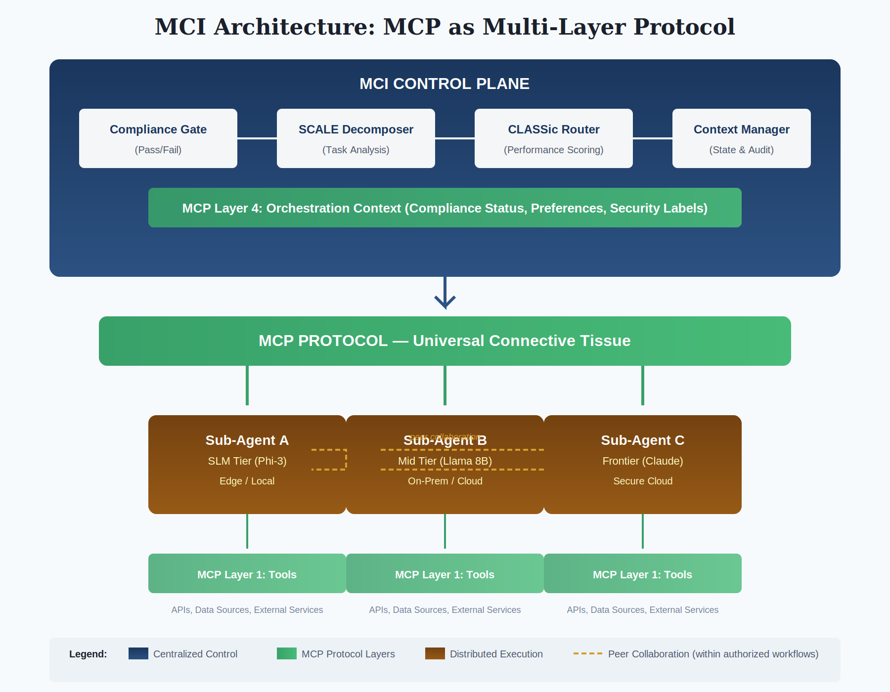

# Model Context Intelligence (MCI)

An architectural pattern for intelligent multi-model orchestration.

## The Forcing Functions

Four independent pressures are converging on the same conclusion: heterogeneous model architectures are inevitable.

| Forcing Function | Implication |
|------------------|-------------|
| **Infrastructure Risk** | Concentrated GPU supply chain is a strategic vulnerability |
| **Economic Crossover** | Fine-tuning specialized models is now cheaper than frontier inference at scale |
| **Accuracy Crossover** | Specialized models often exceed frontier on domain tasks |
| **Compliance Reality** | Some environments have no frontier option — SLMs are the only path |

Organizations will operate across model tiers whether they plan for it or not. The question is whether that transition happens deliberately — with intelligent orchestration — or chaotically.

## The Pattern

MCI defines an architectural pattern for intelligent orchestration with two core decision rubrics:

### SCALE (Decomposition)

When should a task be broken into subtasks?

| Dimension | Question |
|-----------|----------|
| **S**tructure | Is this task naturally decomposable? |
| **C**onsequence | What happens if we fail? |
| **A**ccuracy | What error tolerance exists? |
| **L**atency | What are the time constraints? |
| **E**xperience | How proven is this pattern? |

Consequence governs. Life-safety tasks route to the highest-accuracy option regardless of cost.

### Two-Phase Routing

Where should each task go?

1. **Compliance gate** (pass/fail): Filter to sub-agents meeting regulatory and policy requirements
2. **CLASSic optimization** (gradient): Among compliant options, score on Cost, Latency, Accuracy, Stability, Security

Compliance is non-negotiable. Performance is a gradient within compliant options.

### Hybrid Coordination

How do we balance control with scale?

| Layer | Coordination Model |
|-------|-------------------|
| Policy & Compliance | Centralized (Context Manager + Compliance Gate) |
| Task Routing | Centralized (Intelligent Router) |
| Task Execution | Distributed (Sub-agents do the work) |
| Agent Collaboration | Peer-to-peer (within authorized workflows) |

**Scaling self-management is incongruent with regulation and compliance.** You need a control plane that enforces constraints — not logs that show constraints happened to hold.

### Patterns-Only Learning

How do we improve across security boundaries?

Learning operates on patterns, never content:
- ✅ "Template X succeeded 94% for task type Y"
- ✅ "Sub-agent A has 50ms lower latency than B"
- ❌ Actual task content or outputs

Patterns propagate across enclaves. Content stays put.

## Architecture

*MCP as the universal connective tissue: centralized control plane for policy/routing, distributed execution for scale, peer collaboration within authorized workflows.*

## Documentation

📄 **[Whitepaper: Intelligent Orchestration for the Multi-Model Era](docs/MCI_Whitepaper_Puckett.md)** ([PDF](docs/MCI_Whitepaper_Puckett.pdf))

Covers the full architectural pattern: forcing functions, eight components, five layers, implementation guidance, and domain vignettes.

## Implementation

MCI is a pattern, not an SDK. Implement it with:
- [Microsoft Agent Framework](https://github.com/microsoft/agents)
- [LangChain](https://docs.langchain.com)
- [CrewAI](https://docs.crewai.com)

Or build your own. The pattern is what matters.

## Recent Updates (December 2025)

- **Forcing Functions Framework**: Restructured around four converging pressures driving multi-tier adoption
- **Hybrid Coordination Model**: Centralized control plane + distributed execution
- **Operational vs. Forensic Auditability**: Why real-time control matters for regulated environments
- **Architecture Diagram**: Visual showing MCP as multi-layer connective tissue
- **Verified Economics**: Updated cost differentials with 2025 pricing data

## Status

Working paper. Positions defined, community input welcome.

See [CONTRIBUTING.md](CONTRIBUTING.md) for how to engage.

## License

[CC BY 4.0](https://creativecommons.org/licenses/by/4.0/)

## Author

Paul Puckett  
[linkedin.com/in/pbp3](https://linkedin.com/in/pbp3)
